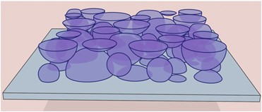

<!-- include image 'documentation/resources/ovrlpy-logo.png -->

A python tool to investigate vertical signal properties of imaging-based spatial transcriptomics data.

## introduction

Much of spatial biology uses microscopic tissue slices to study the spatial distribution of cells and molecules. In the process, tissue slices are often interpreted as 2D representations of 3D biological structures - which can introduce artefacts and inconsistencies in the data whenever structures overlap in the thin vertical dimension of the slice:




Ovrl.py is a quality-control tool for spatial transcriptomics data that can help analysts find sources of vertical signal inconsistency in their data. 
It is works with imaging-based spatial transcriptomics data, such as 10x genomics' Xenium or vizgen's MERFISH platforms. 
The main feature of the tool is the production of 'signal integrity maps' that can help analysts identify sources of signal inconsistency in their data. 
Users can also use the built-in 3D visualisation tool to explore regions of signal inconsistency in their data on a molecular level.

## installation

The tool can be installed using the requirements.txt file in the root directory of the repository.

```bash 
pip install -e .
```

In order to use the ipython notebooks and perform interactive analysis, you will need to install the jupyter package also. For the tutorials, pyarrow and fastparquet are also required.

```bash
pip install jupyter pyarrow fastparquet
```

## quickstart

The simplest use case of ovrlpy is the creation of a signal integrity map from a spatial transcriptomics dataset.
In a first step, we define a number of parameters for the analysis:

```python
import pandas as pd
import ovrlpy

# define ovrlpy analysis parameters:
kde_bandwidth = 2

# load the data

coordinate_df = pd.read_csv('path/to/coordinate_file.csv')
coordinate_df.head()
```

you can then fit an ovrlpy model to the data and create a signal integrity map:

```python

# fit the ovrlpy model to the data


```