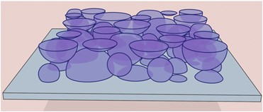

<!-- include image 'documentation/resources/ovrlpy-logo.png -->


A python tool to investigate vertical signal properties of imaging-based spatial transcriptomics data.

## Introduction

Much of spatial biology uses microscopic tissue slices to study the spatial distribution of cells and molecules. In the process, tissue slices are often interpreted as 2D representations of 3D biological structures - which can introduce artefacts and inconsistencies in the data whenever structures overlap in the thin vertical dimension of the slice:




Ovrl.py is a quality-control tool for spatial transcriptomics data that can help analysts find sources of vertical signal inconsistency in their data.
It is works with imaging-based spatial transcriptomics data, such as 10x genomics' Xenium or vizgen's MERFISH platforms.
The main feature of the tool is the production of 'signal integrity maps' that can help analysts identify sources of signal inconsistency in their data.
Users can also use the built-in 3D visualisation tool to explore regions of signal inconsistency in their data on a molecular level.

## Installation

To install the necessary tools and dependencies for this project, follow the steps outlined below. These instructions will guide you through setting up the environment for both standard use and interactive analysis with Jupyter notebooks.


> Make sure you have Python and pip installed on your machine before proceeding.

Steps for Installation
-----------------------

1. **Clone the Repository**

   First, ensure that you have cloned the repository to your local machine. If you haven't already done so, use the following commands:

   ````bash

      git clone https://github.com/HiDiHlabs/ovrl.py.git
      cd ovrl.py

    ````

2. **Install the Package in Editable Mode**

   To install the ovrlpy package, execute the following command:

   ````bash

      pip install .
    ````
   This installs the package based on the current state of the source files.

3. **Set Up for Interactive Analysis (Optional)**

   If you plan to use Jupyter notebooks for interactive analysis or the project's tutorials, you'll need to install some additional packages: **Jupyter**, **pyarrow**, and **fastparquet**. Install them using:

   ````bash

      pip install jupyter pyarrow fastparquet

    ````
Summary of Commands
-------------------

Here's a summary of the commands to run for installation:

    ````bash

   # Step 1: Clone the repository
   git clone https://github.com/HiDiHlabs/ovrl.py.git
   cd ovrl.py

   # Step 2: Install package from source
   pip install .

   # Step 3: Install Jupyter and other packages for interactive analysis
   pip install jupyter pyarrow fastparquet

    ````
## Quickstart
-----------------------
The simplest use case of ovrlpy is the creation of a signal integrity map from a spatial transcriptomics dataset.
1. **Set Parameters & Load Data**

Define parameters and load your data.

```python
import pandas as pd
import ovrlpy

# define ovrlpy analysis parameters:
kde_bandwidth = 2
n_expected_celltypes=20

# load the data

coordinate_df = pd.read_csv('path/to/coordinate_file.csv')
coordinate_df.head()
```

2. **Fit the model** 

Fit the ovrlpy model to create a signal integrity map.

```python

from ovrlpy import ovrlp

integrity, signal, visualizer = ovrlp.compute_coherence_map(
    df=coordinate_df,
    KDE_bandwidth=kde_bandwidth,
    n_expected_celltypes=n_expected_celltypes
)
```

3. **Visualize Model Fit**

```python
visualizer.plot_fit()
```

4. **Plot Signal Integrity Map**
Plot the signal integrity map with a threshold for signal coherence.

```python
fig, ax = ovrlp.plot_signal_integrity(integrity,signal,signal_threshold=4.0)
```

5. **Detect & Visualize Overlaps (Doublets)**

```python
import matplotlib.pyplot as plt
doublet_df = ovrlp.detect_doublets(
    integrity, 
    signal, 
    signal_cutoff=4,
    coherence_sigma=1
)

doublet_df.head()
```

6. **3D Visualization of Overlap Event**
This visualization shows a 3D representation of the spatial overlap event, giving more insight into the structure and coherence of the signals.

```python
window_size = 60
n_doublet_to_show = 0
x, y = doublet_df.loc[n_doublet_to_show, ['x', 'y']]
subsample = visualizer.subsample_df(x, y, coordinate_df, window_size=window_size)
subsample_embedding, subsample_embedding_color = visualizer.transform(subsample)
visualizer.plot_instance(
    subsample,
    subsample[['x', 'y']].values,
    subsample_embedding_color,
    x, y,
    window_size=window_size
)

```
